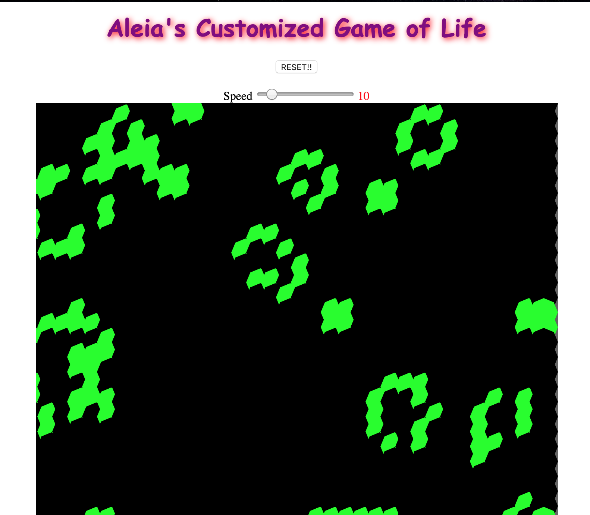

# Aleia's Game Of Life



## What is the Game of Life?

_From the Wikipedia entry for Conway's Game of Life:_

"The universe of the Game of Life is an infinite two-dimensional orthogonal grid of square cells, each of which is in one of two possible states, alive or dead, or "populated" or "unpopulated". Every cell interacts with its eight neighbours, which are the cells that are horizontally, vertically, or diagonally adjacent. At each step in time, the following transitions occur:

Any live cell with fewer than two live neighbours dies, as if caused by underpopulation.
Any live cell with two or three live neighbours lives on to the next generation.
Any live cell with more than three live neighbours dies, as if by overpopulation.
Any dead cell with exactly three live neighbours becomes a live cell, as if by reproduction.
The initial pattern constitutes the seed of the system. The first generation is created by applying the above rules simultaneously to every cell in the seed—births and deaths occur simultaneously, and the discrete moment at which this happens is sometimes called a tick (in other words, each generation is a pure function of the preceding one). The rules continue to be applied repeatedly to create further generations."


***You can also try out this Interactive Game of Life (https://bitstorm.org/gameoflife/) to get a better idea of what you're about to build.***


## Example Code

```javascript
//for creating octogon shape
function polygon(x, y, radius, npoints){
    let angle = TWO_PI / npoints;
  beginShape();
  for (let a = 0; a < TWO_PI; a += angle) {
    let sx = x + cos(a) * radius;
    let sy = y + sin(a) * radius;
    vertex(sx, sy);
  }
  endShape(CLOSE);
}
```

## Usage <a name = "usage"></a>

Visit the live site at [Aleia's Game Of Life](https://robotgyal.github.io/Aleias-Game-Of-Life/)
